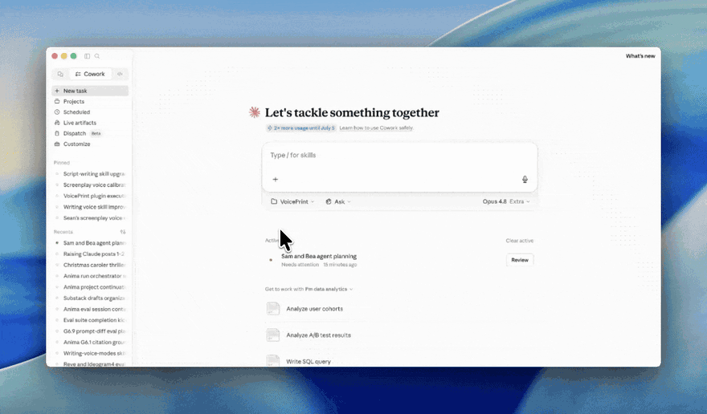

# VoicePrint

**A plugin that hands you your own writing voice as a reusable skill.**

<!-- Sean: optional banner image. Drop a file at .docs/images/hero.png (or delete this line). -->


Most "write like me" tools do the same thing: feed them 10 old posts, they *analyze* your writing and hand back a description, and you paste that description back into the model. It works until you hit the wall every one of them hits: *you can't write down what you don't know you're doing*, and you can't analyze a voice you haven't written down yet.

VoicePrint starts from the opposite end. Before it looks at anything you've written, it generates writing you'll **hate**, in your name, in the register that makes you cringe, and lets your gut reaction draw the outline. (You can't describe your voice, but you can spot what *isn't* it instantly.) Then it maps the references you actually quote and mines whatever real writing you do have. Three kinds of evidence (what you reject, what you love, how you actually build a sentence), quoted back to you, never paraphrased into adjectives.

It productizes the exact process behind the "Raising Claude" Cheese Gauntlet kit: three elicitation sessions, a synthesis step, and a calibration loop you re-run until the voice is yours.

## Start here

Install it (instructions below), open a folder, and run **`/voiceprint-start`**. The first session gets you a sharp outline; the tenth gets you something that sounds like you wrote it.

## What makes it different

- **It learns you from what you reject, not just what you've written.** The Cheese Gauntlet (your disgust as signal) is the part no other voice tool does.
- **It works even if you have no corpus.** Most tools need 10+ samples to get good. VoicePrint's interview + gauntlet produce real signal from zero, and tell you honestly when the result is still outline-grade.
- **It proves it's converging instead of promising magic.** No "80% on the first pass." `/voiceprint-proof` measures your draft against a generic-AI baseline and your own writing, locally, and shows whether it actually moved toward you.
- **Local, free, no account, no upload, no API key.** Your writing never leaves your machine. Nothing to connect, nothing to trust with your data.

## Installation

VoicePrint installs from this GitHub repo as a plugin marketplace. The same source works in both Claude Cowork and Claude Code.

### Claude Cowork (recommended for non-developers)

1. Open **Customize** (bottom-left of Cowork).
2. Go to **Browse plugins** → **Personal** → **+**.
3. Select **Add marketplace from GitHub**.
4. Enter: `seanwinslow28/voiceprint`
5. Install **VoicePrint** when it appears.

<!-- Sean: drop a short screen recording of the Cowork install here, at .docs/images/cowork-install.gif -->


Then open any folder and run `/voiceprint-start`.

### Claude Code (CLI)

Run these in a Claude Code session:

```
/plugin marketplace add seanwinslow28/voiceprint
/plugin install voiceprint@voiceprint
/voiceprint-start
```

Prefer the shell? The same thing, outside a session:

```bash
claude plugin marketplace add seanwinslow28/voiceprint
claude plugin install voiceprint@voiceprint
```

That's it. `/voiceprint-start` sets up your workspace and walks you through the flow below.

## Compatibility: raising more than Claude

VoicePrint is built for Claude (Cowork and Claude Code), where you get the full guided flow. But its skills follow the open [Agent Skills](https://agentskills.io) standard (`SKILL.md`), so the voice-building *craft* travels to other tools too.

| Tool | What you get | How |
|---|---|---|
| **Claude Cowork / Claude Code** | Everything: the guided commands, skills, and proof/dashboard scripts | Install from this repo (see [Installation](#installation)) |
| **Codex CLI (OpenAI)** | The skills. Commands install but don't run as Codex commands; scripts run manually | Reads this repo's marketplace: `codex plugin marketplace add seanwinslow28/voiceprint`, then install via Codex's `/plugins` browser (the `plugin` subcommands are new, so confirm with `codex plugin --help`) |
| **Cursor** | The skills, auto-loaded | Cursor reads `SKILL.md` natively. Copy the `skills/` folders into `.cursor/skills/` (it also auto-discovers `.claude/skills/`) |
| **Gemini CLI** | The skills | `gemini skills install https://github.com/seanwinslow28/voiceprint.git --consent`, or copy into `.gemini/skills/` |
| **OpenCode** | The skills | Copy the `skills/` folders into `.opencode/skills/` (it also auto-reads `.claude/skills/`) |
| **Kiro (AWS)** | The skills (here they become `/slash` commands) | Copy each skill into `.kiro/skills/<name>/SKILL.md` |
| **Others** (VS Code, Copilot, Windsurf, and more) | Growing native `SKILL.md` support | See [agentskills.io](https://agentskills.io) |

**The honest version:** VoicePrint's value is the guided flow (`start → interview → gauntlet → mine → synthesize → refine → proof`), and it runs natively only in Claude Cowork and Claude Code. On every other tool you get the underlying skills (the interview craft, the synthesis method, and the bundled writing skills) as on-demand knowledge: you drive the steps yourself instead of via slash commands, and the proof/dashboard scripts may need to be run by hand. The method travels; the one-command experience is Claude.

## What you do (the flow)

| Step | Command | What happens |
|---|---|---|
| Start here | `/voiceprint-start` | Sets expectations, explains the flow, sets up your workspace |
| A | `/voiceprint-interview` | Maps your real cultural taste, one question at a time, pushing past generic answers |
| B | `/voiceprint-gauntlet` | Generates 10 lines in the register you most hate, in your name; your disgust draws the outline |
| C | `/voiceprint-mine` | You paste pre-AI writing; it extracts how you actually build a sentence, quoting you back |
| D | `/voiceprint-synthesize` | Reads your three reference files and generates your personal voice skill bundle |
| E | `/voiceprint-refine` | Generates a sample in your voice, captures your edits, feeds the diff back. Re-run often. |
| Prove it | `/voiceprint-proof` | Measures your draft against a generic-AI baseline and your own writing; shows, with numbers, whether it's moved toward you |

Do A, B, C in order before D. The gauntlet tells the model what you're *not*; the other two tell it what you *are*. You want all three. Run `/voiceprint-proof` anytime after synthesis to see where you stand.

## What you walk away with

```
voiceprint/
└── my-voice/                       # your installable voice skill
    ├── SKILL.md                    # your modes, signature moves, anti-patterns, dial
    └── references/
        ├── reference-universe.md   # your cultural library (from the interview)
        ├── cheese-bank.md          # the registers you reject (from the gauntlet)
        └── voice-samples.md        # how you build a sentence + your refine diffs
```

Drop `my-voice/` into your own Claude skills folder and write in your voice anywhere.

## The honest expectation

This is **not** a one-shot. One session gets you a sharper outline. The tenth gets you something that sounds like you wrote it. VoicePrint builds the loop in on purpose. It's reps, not a magic prompt. Same as raising anything.

## Local and private

Everything you paste (old writing, reactions, transcripts) stays in your workspace as plain files. Nothing is uploaded anywhere by the plugin. That guarantee is the whole reason "paste me your old writing" is a safe ask.

No API key required. VoicePrint runs entirely in your own Claude session (Cowork or Claude Code), on your own subscription.

## Components

- **7 commands:** `voiceprint-start`, `-interview`, `-gauntlet`, `-mine`, `-synthesize`, `-refine`, `-proof`
- **2 core skills:** `voiceprint-interviewing` (the interview craft), `voiceprint-synthesis` (the generator)
- **4 bundled writing skills:** `storytelling-architecture`, `substack-value-engine`, `writing-critique`, `writing-humanity-pass` (generic, so you get the whole pipeline, not just voice)
- **Scripts:** `fingerprint.py` (the proof report card), `diff_metrics.py` (refine-loop edit measurement), `pile_state.py` (workspace state), `build_dashboard.py` (progress dashboard), plus a shipped generic-AI baseline to compare against

## Credits

Built from the method in the "Raising Claude" series. The bundled `writing-critique` and `writing-humanity-pass` skills adapt, respectively, `haowjy/creative-writing-skills` (Apache 2.0) and `blader/humanizer` (MIT). Attribution retained in each skill.
